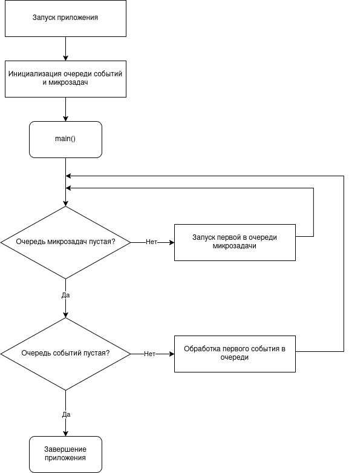

Эта статья начинает цикл статей про параллельное программирование в Dart.

Весь Dart-код выполняется в изолятах. Сначала запускается основной изолят, и опционально количество изолятов можно расширить, создав их явно. Каждый изолят имеет собственную изолированную память и свой **цикл событий (Event Loop)**. Благодаря именно циклу событий можно асинхронно выполнять различные операции.

После запуска приложений инициализируется две очереди: **Очередь событий (Event Queue)** и **очередь микрозадач (Microtask Queue)**.

**Очередь событий** может содержать как любые события: ввод-вывод, нажатия клавиш, запросы на перерисовку пользовательского интерфейса, сообщения между изолятами и т. д. Приложение не может предсказать в каком порядке произойдут события, поэтому они обрабатываются по одному за раз, в порядке постановки их в очередь. Чтобы добавить элемент в эту очередь используется класс `Future`.

**Очередь микрозадач** используется для коротких действий, которые нужно выполнять асинхронно, сразу после завершения какого-либо события и перед тем, как управление не перейдет в очередь событий. Эта очередь обрабатывается первой и до тех пор, пока не будут выполнены все микрозадачи. Чтобы добавить микрозадачу в эту очередь можно использовать именованный конструктор `Future.microtask` или функцию верхнего уровня `scheduleMicrotask`.

Свою работу цикл событий начинает после выхода потока управления из функции `main`. То есть сначала будут выполнены все синхронные задачи в этой функции. Если будут встречаться асинхронные вызовы, то они будут помещаться в соответствующие очереди.

Работу цикла можно описать следующими шагами:
1. Выполняются микрозадачи в порядке их нахождения в очереди микрозадач.
2. Обрабатывается первый элемента в очереди событий.
3. Повторение цикла
4. Если обе очереди пусты и больше не ожидается событий, то приложение завершается.

Обычно при планировании отложенных задач лучше использовать `Future`, потому что это поможет сохранить короткую очередь микрозадач, уменьшая вероятность, что из-за нее будет простаивать цикл событий.
